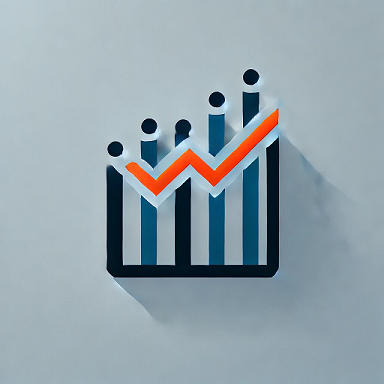

# js-charts

js-charts is for ***anyone*** with ***no*** **programming experience** who wishes to add high-quality charts to their website, presentation or documentation.

js-charts is a free, almost no-code charting and graphing solution. Charts and input data are defined as HTML containers, which are parsed and rendered as a printable chart.

- **No coding skill** is required to create charts that are both functional and beautiful.
- Cross platform and cross browser compatible.
- Only uses JS and CSS - **supported by all modern browsers**.
- Easy implementation on static, or complex and dynamic websites.
- All chart elements are **fully customizable** and provide an array of user interactions.
- No external dependancies.
- Always **privacy** and **security** focused.
- ***[js-chart-builder](https://github.com/wrathtafarian/js-chart-builder)*** lets you quickly and easily prototype charts for use on static websites, or for one-time use in presentations or documentation.
- Visit ***[js-chart-examples](https://github.com/wrathtafarian/js-chart-examples)*** to see all of the cool things that can be done with **js-charts**.

## 🔒 Security and Privacy

This project is built with a strong focus on security and privacy.

The codebase consists solely of JavaScript and Cascading Style Sheet (CSS) files used to execute and render charts. These files are purely frontend assets and **do not** collect, track, or transmit any data—either to the project server or to any third parties.

### Hosting and Delivery

You have the option to:

 - **Self-host** the JavaScript and CSS files within your own infrastructure, or
 - **Link directly** to the files hosted on the project's official website.

If you choose to use the hosted version, all resources are served securely over **TLS 1.2 or higher**, ensuring the integrity and confidentiality of the connection between your site and the project server.

### No Data Collection

This project:

 - Does **not** use cookies
 - Does **not** include analytics
 - Does **not** make outbound requests or track usage

It is fully suitable for privacy-conscious environments, and can be safely embedded in systems with strict data handling policies.

### Reporting Vulnerabilities

We take security and privacy **very seriously**. If you discover any vulnerabilities, bugs, or concerns, please contact the project moderator directly via email at jsopencharts@gmail.com

👉 *Please do not open a public issue to report security-related concerns.*

We appreciate responsible disclosure and aim to address reports promptly and professionally.

### Staying Up to Date

For security best practices:

 - Ensure you’re always using the latest version of the project files.
 - Subscribe to release notifications (if applicable) for patch updates

## Supported Charts
_js_charts_ currently supports **18 chart types** featuring **37 unique charts**.

| Chart Type                      | Chart Type                         |
|--------------------------------:|------------------------------------|
| [Bar Chart](https://github.com/wrathtafarian/js-charts/wiki/Chart-Types-Bar-Charts)                               | [Column Chart](https://github.com/wrathtafarian/js-charts/wiki/Chart-Types-Column-Charts) |
| [Stacked Bar Chart](/wiki/charts/Bar%20Charts.md)                       | [Stacked Column Chart](/wiki/charts/Column%20Charts.md) |
| [100% Stacked Bar Chart](/wiki/charts/Bar%20Charts.md)                  | [100% Stacked Column Chart](/wiki/charts/Column%20Charts.md) |
| [OHLC Chart](/wiki/charts/Open-High-Low-Close%20Charts.md)              | [Candlestick Charts](/wiki/charts/Candlestick%20Charts.md) |
| [Scatter Plot](/wiki/charts/Scatter%20Plot.md)                          | [Bubble Chart](/wiki/charts/Bubble%20Charts.md) |
| [Horizontal Boxplot](/wiki/charts/Box%20Plot.md)                        | [Vertical Boxplot](/wiki/charts/Box%20Plot.md) |
| [Lollipop Bar Chart](/wiki/charts/Lollipop%20Charts.md)                 | [Lollipop Column Chart](/wiki/charts/Lollipop%20Charts.md) |
| [Stacked Lollipop Bar Chart](/wiki/charts/Lollipop%20Charts.md)         | [Stacked Lollipop Column Chart](/wiki/charts/Lollipop%20Charts.md) |
| [100% Stacked Lollipop Bar Chart](/wiki/charts/Lollipop%20Charts.md)    | [100% Stacked Lollipop Column Chart](/wiki/charts/Lollipop%20Charts.md) |
| [Pie Chart](/wiki/charts/Pie%20and%20Doughnut%20Charts.md)              | [Line Chart](/wiki/charts/Line%20Charts.md) |
| [Doughnut Chart](/wiki/charts/Pie%20and%20Doughnut%20Charts.md)         | [Stacked Line Chart](/wiki/charts/Line%20Charts.md) |
| [Stacked Doughnut Chart](/wiki/charts/Pie%20and%20Doughnut%20Charts.md) | [100% Stacked Line Chart](/wiki/charts/Line%20Charts.md) |
| [Waterfall Bar Chart](/wiki/charts/Waterfall%20Chart.md)                | [Watarfall Column Chart](/wiki/charts/Waterfall%20Chart.md) |
| [Span Bar Chart](/wiki/charts/Span%20Chart.md)                          | [Span Column Chart](/wiki/charts/Span%20Chart.md) |
| [Marimekko Bar Chart](/wiki/charts/Mekko%20Charts.md)                   | [Marimekko Column Chart](/wiki/charts/Mekko%20Charts.md) |
| [Treemap](/wiki/charts/Treemaps.md)                                     | [Parallel Coordinates Chart](/wiki/charts/Parallel%20Coordinates%20Charts.md) |
| [Funnel Bar Chart](/wiki/charts/Funnel%20Charts.md)                     | [Funnel Column Chart](/wiki/charts/Funnel%20Charts.md) |
| [Heatmap Chart](/wiki/charts/Heatmaps.md)                               | [Histogram Chart](/wiki/charts/Histograms.md) |
| [Population Pyramid Chart](/wiki/charts/Population%20Pyramid.md)        |                                    |

## Contributing
I welcome contributions! If you’d like to help improve this project:
1. Open an issue with your idea or bug report.
1. Wait for approval before starting any work.
1. Fork the repository (only after approval).
1. Create a new branch.
1. Submit a pull request with a clear description of your changes.

Note: Forking this project without prior consent is not permitted. __I reserve the right to reject unauthorized forks or clones__. For collaboration, please open an issue or contact me first.

### ⚠️ The project is in need of testers

If you want to contribute to testing, please contact the moderator who can guide you how best to assist.

##  License
This project is licensed under the Apache License 2.0. See the [LICENSE](./LICENSE) page for details.

## Contact

Created and maintained by wrathtafarian
    Email: wrathtafarian@hotmail.com
